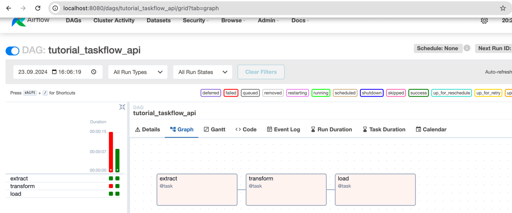

# Airflow Tutorial

## Purpose
The purpose of this project is to explore Airflow.

## Project details



### Airflow installation
Airflow installation:
https://airflow.apache.org/docs/apache-airflow/stable/start.html


Recommendations:
- create a venv before proceeding with airflow installation
- if airflow was already installed earlier and you are facing issues with that set-up, it might make 
sense to reinstall it using: 
```
pip uninstall apache-airflow
```
- create dags under Airflow home (not in a separate python project)


### Operators
BashOperator
BasOperator output can be seen in the logs.

HTTPOperator
The code examples use the http_default connection which means the requests are sent against httpbin site to perform basic HTTP operations.
To edit default connection, go to Airflow UI/Admin/Connections and search for http_default.

Other options for using REST API: 
https://medium.com/towards-data-engineering/airflow-3-ways-to-call-a-rest-api-78181fca6fe8

### Other notes
####  HTTP workaround for MAC
I found out that there were troubles using HTTP operator or Python operator with requests
lib on my Mac. There is an HTTP workaround available for MAC: 
```
# fix for mac machines
import os
from _scproxy import _get_proxy_settings

_get_proxy_settings()
os.environ['NO_PROXY'] = '*'
```

#### MISC NOTES: 
Web server restart (eg when changing configs): 
``` airflow webserver -p 8080 -D ```

#### Change config
``` 
# if you wish not to load example dags on the UI 
load_examples = False

# if you wish to access config throgh UI here: http://localhost:8080/configuration
expose_config = True
#

```

#### Understanding Airflow commands

``` 
airflow standalone
# initializes the database, creates a user, and starts all components (all-in-one)
# saves password to standalone_admin_password.txt in your airflow home

# alternative to standalone if you want to run the individual parts of Airflow manually
airflow db migrate

airflow users create \
    --username admin \
    --firstname Peter \
    --lastname Parker \
    --role Admin \
    --email spiderman@superhero.org

airflow webserver --port 8080
airflow scheduler


```

#### XCOM
Inspired by: 
https://marclamberti.com/blog/airflow-xcom/

ti - task instance.
Once we access the task instance object, we can call xcom_push.
